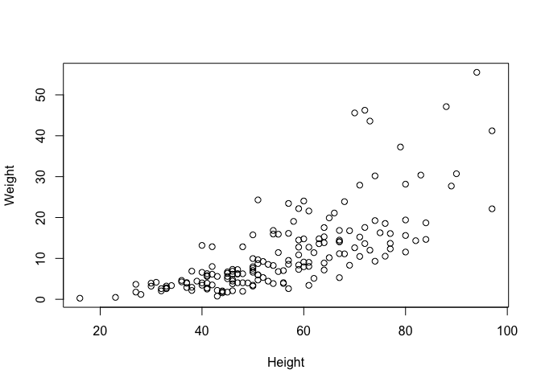
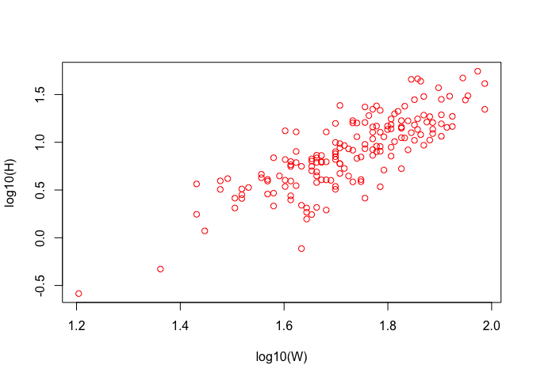

Analytical pipeline
================
Jerry Moxley
May 14, 2019

Allometry Project
-----------------

> How does seed weight scale with height? - H0 no relationship - H1 linear, scaling slope ~ 1 - H2 Cubic, length scales to third power w/ volume (i.e., mass) - H3 2nd power, grows in single dimension

    ## 'data.frame':    169 obs. of  8 variables:
    ##  $ Plot             : chr  "plot-2" "plot-2" "plot-2" "plot-2" ...
    ##  $ Seed.herbivore   : logi  TRUE TRUE TRUE TRUE TRUE TRUE ...
    ##  $ Root.herbivore   : logi  TRUE TRUE TRUE FALSE FALSE FALSE ...
    ##  $ No.stems         : int  1 3 1 1 1 1 3 2 1 1 ...
    ##  $ Height           : int  31 41 42 64 47 52 57 27 40 33 ...
    ##  $ Weight           : num  4.16 5.82 3.51 7.16 6.17 ...
    ##  $ Seed.heads       : int  83 175 72 125 212 114 522 28 81 43 ...
    ##  $ Seeds.in.25.heads: int  7 0 32 22 3 19 7 24 46 8 ...

A function for standard error
-----------------------------

``` r
#heres a fxn for calc standard error
standard.err <- function(x){
  #this calc's standard error
  sd(x, na.rm = T) / sqrt(length(x))
}
```

Seeds plotting, weight ~ height
-------------------------------

``` r
#plot(seeds$Height, seeds$Weight)
plot(Weight ~ Height, data = seeds)
```



Data Transformation
-------------------

``` r
#add new col
seeds$Weight_log10 <- log10(seeds$Weight)
seeds$Height_log10 <- log10(seeds$Height)
plot(Weight_log10 ~ Height_log10, data = seeds, col = "red", xlab = "log10(W)", ylab="log10(H)")
```



Data analysis
-------------

We will run a linear regression on log-transformed variables to look for scaling coefficient.

``` r
mod <- lm(Weight_log10 ~ Height_log10, data = seeds)
summary(mod)
```

    ## 
    ## Call:
    ## lm(formula = Weight_log10 ~ Height_log10, data = seeds)
    ## 
    ## Residuals:
    ##      Min       1Q   Median       3Q      Max 
    ## -0.78676 -0.13950  0.01404  0.12981  0.53483 
    ## 
    ## Coefficients:
    ##              Estimate Std. Error t value Pr(>|t|)    
    ## (Intercept)   -3.2440     0.2330  -13.92   <2e-16 ***
    ## Height_log10   2.3981     0.1346   17.81   <2e-16 ***
    ## ---
    ## Signif. codes:  0 '***' 0.001 '**' 0.01 '*' 0.05 '.' 0.1 ' ' 1
    ## 
    ## Residual standard error: 0.2286 on 167 degrees of freedom
    ## Multiple R-squared:  0.6552, Adjusted R-squared:  0.6531 
    ## F-statistic: 317.3 on 1 and 167 DF,  p-value: < 2.2e-16

``` r
#store results
write.csv(mod$coef, file = "output/mod_results.csv")

anova(mod)
```

    ## Analysis of Variance Table
    ## 
    ## Response: Weight_log10
    ##               Df Sum Sq Mean Sq F value    Pr(>F)    
    ## Height_log10   1 16.585 16.5854  317.34 < 2.2e-16 ***
    ## Residuals    167  8.728  0.0523                      
    ## ---
    ## Signif. codes:  0 '***' 0.001 '**' 0.01 '*' 0.05 '.' 0.1 ' ' 1

``` r
#predictions based on regression
h <- sort(seeds$Height_log10)
pred <- predict(mod, list(Height_log10 = h), interval = "confidence")

png('output/hVSw_relationship.png')
plot(Weight_log10 ~ Height_log10, data = seeds, col = "grey", xlab = "Height, log10")
lines(h, pred[,1], col="black", lty=2)
polygon(c(h, rev(h)), c(pred[,2], rev(pred[,3])),
          col = rgb(0,0,1,0.2), border = NA)
dev.off()
```

    ## quartz_off_screen 
    ##                 2

Conclusion
==========

My final plot:  The slope of the relationship between height and weight is 2.4
